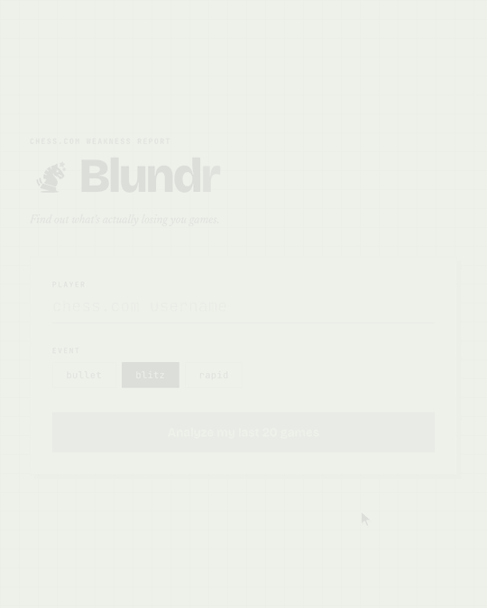

# Blundr

Give it a Chess.com username. It pulls your last 20 games in one time control,
runs every move through Stockfish, and hands back a report card of
**fundamentals** weaknesses — tactics, endgame technique, time management,
conversion — each with specific, evidence-backed practice advice.

<p align="center">
  
</p>

[Quick start](#quick-start) · [How it works](#how-it-works) ·
[Project layout](#project-layout) · [Development](#development) ·
[Configuration](#configuration) · [Summary provider](#summary-provider) ·
[API](#api) · [Recalibrating](#recalibrating-the-weakness-scores)

[`docs/prd.md`](docs/prd.md) is the full spec — problem, scope, weakness
taxonomy, pipeline, API contract and classifier thresholds.

## Quick start

### Docker — nothing to install

Stockfish, Python and Node all live in the images, so Docker is the only
prerequisite.

```bash
git clone https://github.com/D-Aldana/blundr.git
cd blundr
docker compose up
```

Open <http://localhost:5173>. Both services hot-reload from your working tree.

### Native — faster to develop against

```bash
make setup    # checks your toolchain, then installs everything
make dev      # both servers in one terminal; ctrl-c stops both
```

`make setup` needs Python 3.10+, Node 20+ and Stockfish, and tells you exactly
what to install for anything missing.

No API key needed either way — without one the closing summary falls back to a
deterministic paragraph and the rest of the report is unaffected. To add one,
`cp .env.example .env` and fill it in before starting; see
[Summary provider](#summary-provider).

## How it works

`POST /analyze` returns a job id immediately and the pipeline runs in the
background. Each stage sets a machine-readable `step` on the job, which the
frontend turns into display copy in `frontend/src/copy.ts`:

| `step` | What happens | Code |
|---|---|---|
| `fetching_games` | Last 20 games in the time control, from the Chess.com public API | `chesscom.py` |
| `queued` | Only when the engine is at its concurrency cap | `main.py` |
| `evaluating_games` | Stockfish scores every move into a flat per-move dataset — this dominates the wall clock | `engine.py` |
| `classifying_weaknesses` | Four deterministic classifiers turn moves into per-category rates | `classify.py` |
| `generating_recommendations` | Worst categories map to drills with evidence attached | `recommend.py` |
| `writing_summary` | An LLM writes the closing paragraph; a validator checks it against the scores | `summary.py` |

Scores are rates, not raw counts, so a player with fewer chances isn't punished
for them. Each category is measured against a calibrated constant where `1.00`
is roughly the worst 1 in 10 of comparable players — see
[Recalibrating](#recalibrating-the-weakness-scores).

Expect **about 70 seconds** for 20 blitz games at the default depth of 12.

## Project layout

```
backend/              FastAPI app
  app/
    main.py           endpoints, in-memory job store, concurrency, rate limits
    config.py         every threshold and tunable (PRD §15)
    chesscom.py       Chess.com archive fetch
    engine.py         Stockfish evaluation -> flat per-move dataset
    classify.py       the four deterministic classifiers
    recommend.py      worst categories -> evidence-backed advice
    summary.py        LLM summary + output-validation guardrail
    report.py         final report payload
    providers/        anthropic / openai / ollama, behind one interface
  scripts/            calibrate.py
  tests/
frontend/             Vite + React + TS + Tailwind
  src/
    api.ts            typed client for the three endpoints
    copy.ts           step/error keys -> display text
    components/       Scoresheet (form), Analyzing, Report
branding/             Blundr knight mark: master art + generated icon/PWA set
docs/                 prd.md
docker-compose.yml    dev stack — both services, no local toolchain
Makefile              native setup and dev loop
```

## Development

| Command | Does |
|---|---|
| `make` | List every target |
| `make setup` | Preflight the toolchain, then install both sides |
| `make dev` | Backend on `:8000` and frontend on `:5173` together |
| `make backend` / `make frontend` | One side only |
| `make test` | Backend pytest |
| `make docker` | Rebuild and run the containers |
| `make clean` | Drop the venv, `node_modules` and build output |

The three commands CI runs, and what a PR has to pass:

```bash
make test                      # backend pytest
cd frontend && npm run lint    # oxlint
cd frontend && npm run build   # tsc -b && vite build — this is the type check
```

The suite is fast and hermetic: nothing in it reaches Chess.com, a real engine
or an LLM. The engine tests drive a stub UCI binary, so you don't need
Stockfish installed to run them. `backend/tests/conftest.py` has the fixtures
for faking all three.

## Configuration

Copy `.env.example` to `.env` at the repo root and fill in what you need — it's
loaded at startup and gitignored. A real environment variable always wins over
the file. **Every value is optional; all of them have working defaults.**

**Engine**

| Variable | Default | Notes |
|---|---|---|
| `STOCKFISH_PATH` | `stockfish` | Path to the engine binary |
| `ENGINE_DEPTH` | `12` | Lower is faster, less precise (PRD §12) |
| `ENGINE_THREADS` / `ENGINE_HASH_MB` | `2` / `128` | Engine resources |
| `ENGINE_TIMEOUT_S` | `300` | Whole-stage cap; a wedged engine fails the job |

**Load limits**

| Variable | Default | Notes |
|---|---|---|
| `MAX_CONCURRENT_ANALYSES` | `1` | Engine stages at once — the cap that protects the CPU |
| `MAX_QUEUED_ANALYSES` | `8` | Jobs allowed to wait for a slot; past this `/analyze` returns 503 |
| `RATE_LIMIT_ANALYZE` | `50` | Analyses per IP per hour — a runaway-loop backstop for local use |
| `RATE_LIMIT_ELIGIBILITY` | `200` | Eligibility checks per IP per hour |
| `SUMMARY_DAILY_BUDGET` | `200` | Paid LLM calls per rolling day; past it the summary falls back |

**Everything else**

| Variable | Default | Notes |
|---|---|---|
| `CHESS_COM_CONTACT` | `you@example.com` | Set your own address — Chess.com asks for a real contact in the User-Agent |
| `ALLOWED_ORIGINS` | `http://localhost:5173` | Comma-separated CORS origins |
| `LLM_PROVIDER` | auto | `anthropic`, `openai` or `ollama`; unset picks whichever key is present |
| `SUMMARY_MODEL` | per provider | Overrides the provider's default model |
| `TRUST_PROXY_HEADER` | `false` | **`true` only behind a proxy that overwrites `X-Forwarded-For`** — otherwise callers can forge an IP and bypass every rate limit |

The defaults assume the way this runs: one person, one machine. An analysis
pins a core for over a minute, so `MAX_CONCURRENT_ANALYSES` is the knob that
matters most if you raise anything.

## Summary provider

The closing paragraph is the only part of the report an LLM touches, and it
never sees a move — only your computed scores, which a validator then checks
the prose back against. So any half-decent model does the job, including one
running on your own machine.

| Provider | Set | Default model |
|---|---|---|
| Anthropic | `ANTHROPIC_API_KEY=sk-ant-...` | `claude-haiku-4-5` |
| OpenAI | `OPENAI_API_KEY=sk-...` | `gpt-4o-mini` |
| Ollama | `LLM_PROVIDER=ollama` | `llama3.2` |

Set a key and Blundr works out the rest. With both keys set Anthropic wins;
`LLM_PROVIDER` overrides that, and `SUMMARY_MODEL` overrides the model:

```bash
LLM_PROVIDER=openai SUMMARY_MODEL=gpt-4o
```

**Local, free, no key** — Ollama is never auto-detected, so name it:

```bash
LLM_PROVIDER=ollama SUMMARY_MODEL=llama3.2
```

Running Blundr in Docker but Ollama on your machine? `localhost` from inside
the container *is* the container, so point it at the host instead — nothing
else needs changing, and Ollama can stay on its default loopback binding:

```bash
OLLAMA_HOST=http://host.docker.internal:11434
```

**Anything OpenAI-compatible** — Groq, OpenRouter, Together, Gemini's
compatibility layer, LM Studio, vLLM — point `OPENAI_BASE_URL` at it:

```bash
LLM_PROVIDER=openai
OPENAI_BASE_URL=https://api.groq.com/openai/v1
OPENAI_API_KEY=gsk_...
SUMMARY_MODEL=llama-3.3-70b-versatile
```

With no provider configured the report still works — the summary falls back to
a deterministic paragraph built from your scores, and `summary_source` in the
payload says `"fallback"` so it's never mistaken for model-written prose. Same
if the call fails, times out, or the model writes something the validator
rejects twice. Adding a provider is one module in
`backend/app/providers/` with two functions.

## API

Three endpoints (PRD §14), plus `GET /healthz`.

**1. Check eligibility** — optional; `/analyze` enforces the same rule.

```bash
curl -X POST localhost:8000/eligibility -H 'content-type: application/json' \
  -d '{"username":"hikaru","time_control":"blitz"}'
```

```json
{ "eligible": true, "game_count": 412 }
```

Too few games comes back with playable alternatives, which the UI offers as
one-click retries:

```json
{ "eligible": false, "game_count": 3,
  "alternatives": [{ "time_control": "rapid", "game_count": 88 }] }
```

**2. Start a job** — returns immediately; `503` with `Retry-After` when the
queue is full.

```bash
curl -X POST localhost:8000/analyze -H 'content-type: application/json' \
  -d '{"username":"hikaru","time_control":"blitz"}'
```

```json
{ "job_id": "a1b2c3d4-..." }
```

**3. Poll it** until `status` is `done` or `failed`.

```bash
curl localhost:8000/analyze/<job_id>
```

```json
{ "status": "running", "step": "evaluating_games", "progress": 0.42 }
```

```json
{ "status": "done", "report": {
    "username": "hikaru", "headline": "...", "time_control": "blitz",
    "games_analyzed": 20,
    "categories": [{ "name": "tactical", "score": 0.71,
                     "confidence": "ok", "instances": 9 }],
    "recommendations": [{ "category": "tactical", "text": "...",
                          "evidence": "...", "pattern": "..." }],
    "summary": "...", "summary_source": "llm" } }
```

Failures arrive as a status, not an exception: `{"status":"failed","error":"stockfish_timeout"}`.
`frontend/src/copy.ts` maps every error code to display text.

## Recalibrating the weakness scores

Category scores are rates measured against per-category constants in
`config.SEVERE_RATE`, each the 90th-percentile rate among real accounts in the
target rating band. To re-derive them, from `backend/`:

```bash
python scripts/calibrate.py sample    # bucket club members by blitz rating
python scripts/calibrate.py sweep     # run the pipeline over the sample (~1 min/player)
python scripts/calibrate.py report    # rate distributions + proposed constants
```

The anonymized sample behind the current constants is in
`backend/calibration/results.json`. [`docs/prd.md`](docs/prd.md) §15 covers
what the numbers mean and which categories discriminate well.

## Contributing

Issues and pull requests are welcome — bug reports, sharper copy, another LLM
provider, more calibration data. [`CONTRIBUTING.md`](CONTRIBUTING.md) covers
what has to pass, where things live, and what's deliberately out of scope.

If something confused you while running it, that's worth an issue on its own.

## Branding

The stumbling-knight mark, its palette, and the full favicon/PWA/OG asset set
live in [`branding/blundr-knight/`](branding/blundr-knight/README.md). The
generated files are already wired into `frontend/public/`, so the only reason
to touch that folder is to regenerate assets from the master art.

| Ink navy | Paper cream | Chalk white | Blunder red |
|---|---|---|---|
| `#10214A` | `#EEF0EA` | `#FBFCFA` | `#C8362B` |

## License

MIT — see [`LICENSE`](LICENSE).
